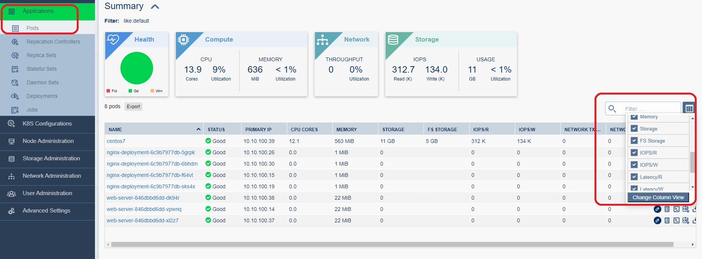
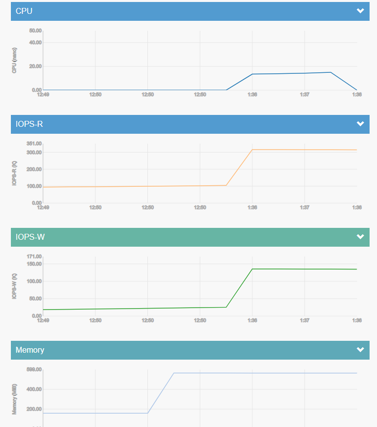

# Kubernetes Performance Monitoring

- ### Kubernetes는 성능 모니터링(cpu, memory, IOPS 등)을 위하여 기본 Package 이 외 별도 Component 설치 필요
- ### Diamanti는 성능 모니터링에 필요한 Metrics, Prometheus, Admin Page 등을 기본 제공함
- ### 성능 확인은 Admin GUI Page 또는 kubectl top {node/pod} 명령어로 확인 가능 

### Metrics Server POD
```
spkr@erdia22:~/02.k8s/diamanti-k8s-bootcamp$ kc get pod -n kube-system
NAME                                 READY   STATUS    RESTARTS   AGE
coredns-54d89499d4-98lqg             1/1     Running   0          6d22h
coredns-54d89499d4-tn9t9             1/1     Running   0          8d
coredns-54d89499d4-vr5bz             1/1     Running   0          28d
helm-chart-687577f867-9c6jh          1/1     Running   0          8d
metrics-server-v1-5d46b6d959-2sjfl   1/1     Running   0          28d
novnc-547484d7df-r7zvm               1/1     Running   0          8d
tiller-deploy-5668df8bc4-s4b7m       1/1     Running   0          7d2h
```

### 부하 생성을 위한 POD, PVC 생성 

소스 코드 : [PVC](./high-pvc.yml)

소스 코드 : [CentOS POD](./centos7-pod.yml)

```
vi high-pvc.yml 

apiVersion: v1
kind: PersistentVolumeClaim
metadata:
  name: perf-pvc
spec:
  accessModes:
  - ReadWriteOnce
  resources:
    requests:
      storage: 10Gi
  storageClassName: high

vi centos7-pod.yml

apiVersion: v1
kind: Pod
metadata:
  annotations:
    diamanti.com/endpoint0: '{"network":"blue","perfTier":"high"}'
  name: centos7
  namespace: default
  labels:
    run: centos7
spec:
  containers:
  - name: centos7
    image: centos:7
    command:
      - "/bin/sh"
      - "-c"
      - "sleep inf"
    volumeMounts:
      - mountPath: /data
        name: perf-vol
  volumes:
  - name: perf-vol
    persistentVolumeClaim:
      claimName: perf-pvc
```

### 부하 생성 툴 fio 설치(yum)
```
spkr@erdia22:~/02.k8s/diamanti-k8s-bootcamp/17.PerfMonitoring$ kc exec -it centos7 -- bash
[root@centos7 /]# yum -y install fio
Loaded plugins: fastestmirror, ovl
(...)
```

### FIO 설정 파일

소스 코드 : [FIO 예시 파일](./randread.fio)
```
vi randread.fio

[global]
ioengine=libaio
rw=randrw
numjobs=16
direct=1
bs=4k
filename=/data/testfile
runtime=60
time_based=1
iodepth=16
size=5g
group_reporting
rwmixread=100
rwmixwrite=0
[read]
```

### 부하 생성 및 부하 테스트 결과 예시
```
[root@centos7 /]# fio randread.fio --output /data/randread.out
Jobs: 16 (f=16): [r(16)][14.8%][r=1948MiB/s,w=0KiB/s][r=499k,w=0 IOPS][eta 00m:52s]
(...)

[root@centos7 /]# cat /data/randread.out
read: (g=0): rw=randrw, bs=(R) 4096B-4096B, (W) 4096B-4096B, (T) 4096B-4096B, ioengine=libaio, iodepth=16
...
fio-3.7
Starting 16 processes
read: Laying out IO file (1 file / 5120MiB)

read: (groupid=0, jobs=16): err= 0: pid=153: Fri Jun 19 04:27:42 2020
   read: IOPS=519k, BW=2029MiB/s (2127MB/s)(119GiB/60001msec)
    slat (usec): min=2, max=13429, avg=28.83, stdev=64.04
(...)
```
- READ IOPS 519K 

### Admin GUI Page 성능 확인 

개별 POD 별 성능


CPU, Memory, Disk 용량 사용량, IOPS(Read/Write), Latency(Read/Write), Bandwidth(Rx/Tx) 등 상세 정보 확인 가능 

시계열 성능 그래프

