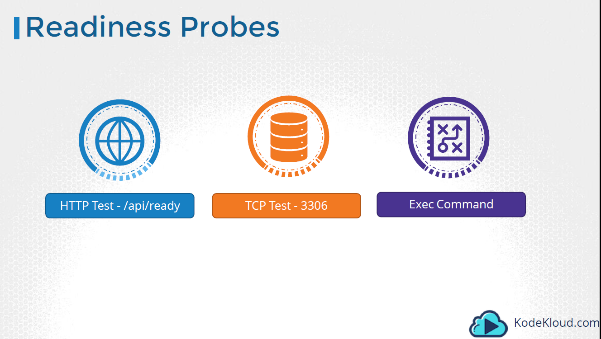

# Kubernetes Liveness Readiness Probe
- ### 컨테이너 Hang 등의 상황으로 Process는 실행 중이나 정상 실행 중이지 않을 경우 컨테이너를 강제 Restart 설정(liveness Probe)
- ### 컨테이너가 준비되지 않으면 외부 컨테이너로 부터 서비스 Requests를 받지 않도록 하는 기능(readiness Probe)

### Liveness Probe
소스 코드 : [http-liveness-pod](./http-liveness-pod.yml)

```
vi http-liveness-pod.yml
(...) 
    livenessProbe:
      httpGet:
        path: /healthz
        port: 8080
        httpHeaders:
        - name: Custom-Header
          value: Awesome
      initialDelaySeconds: 3
      periodSeconds: 3
      
```

HTTP Response가 정해진 조건을 만족하지 않으면 POD Restart 실행 

### Readiness Probe
소스 코드 : [tcp-read-live-probe-pod](./tcp-read-live-probe-pod.yml)

```
vi tcp-read-live-probe-pod.yml
(...)
    readinessProbe:
      tcpSocket:
        port: 8080
      initialDelaySeconds: 5
      periodSeconds: 10

```

HTTP Request가 아닌 TCP Socket 응답으로 체크
해당 Request가 정상적이지 않을 경우 외부 서비스로 부터 응답을 받지 않음 

### Liveness, Readiness Probe 3가지 옵션


HTTP / TCP / Exec(명령어 실행) 3가지 옵션 사용 가능 


